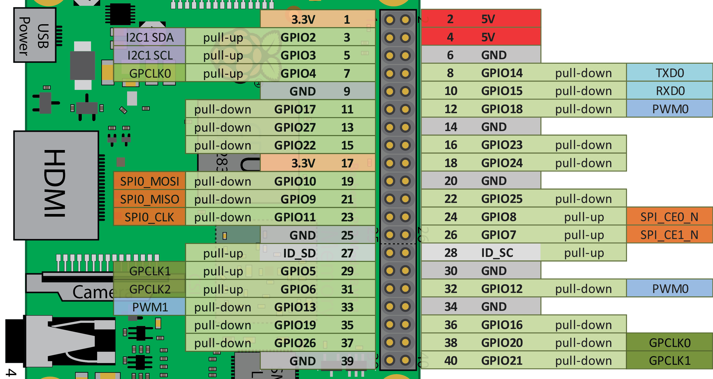

# hama-beads
Raspberry Pi Project (Work in Progress)


### Steps


**Install pip**

 
```bash
 $ sudo apt-get update
 $ sudo apt-get install python-pip
 
 $ sudo apt-get install python-pip python-dev libssl-dev libcurl4-openssl-dev libjpeg-dev
 ```


**Install PIL module**

For images -> 

````bash
 $ pip --no-cache-dir install motioneye
````

**Install requests module**

For http load -> 
```bash
$ pip install requests
```

### Run Test

```bash
python -m unittest tests.test_pixel_image_parser
```

### Dry Run 

Local Image placing **reds** only

```bash
python hamapi/hama_beads_creator.py -t local -i test_resources/images/streetfighter_sagat.png
```

### Stepper Motor Pins



